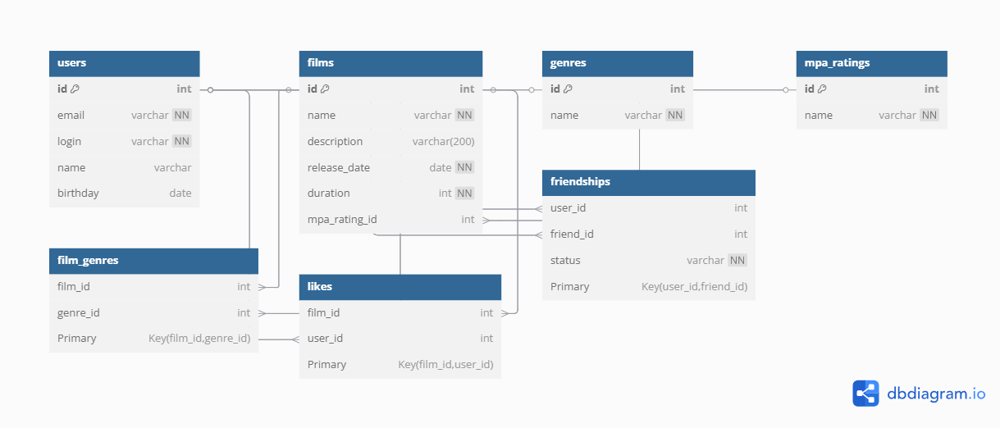

# java-filmorate
Template repository for Filmorate project.
## Database Schema


[Interactive Diagram](https://dbdiagram.io/d/68596f21f039ec6d367ef618)

## 📋 Обзор схемы базы данных
База данных состоит из 7 взаимосвязанных таблиц, обеспечивающих работу приложения для управления фильмами и пользователями.

### 🧑‍🤝‍🧑 Пользователи (users)
```sql
users {
  id int [pk, increment]          // Уникальный идентификатор
  email varchar [not null, unique] // Уникальный email
  login varchar [not null, unique] // Уникальный логин
  name varchar                     // Отображаемое имя
  birthday date                    // Дата рождения
}
```
### 🧑‍🤝‍🧑  Фильмы (films)
```sql
films {
  id int [pk, increment]            // Уникальный идентификатор
  name varchar [not null]            // Название фильма
  description varchar(200)           // Описание (до 200 символов)
  release_date date [not null]       // Дата выхода
  duration int [not null]            // Длительность в минутах
  mpa_rating_id int [ref: > mpa_ratings.id] // Ссылка на рейтинг
}
```
### 📚 Справочники
```sql
// Жанры
genres {
  id int [pk]          // Идентификатор жанра
  name varchar [not null, unique] // Название (Комедия, Драма и т.д.)
}

// Рейтинги MPA
mpa_ratings {
  id int [pk]          // Идентификатор рейтинга
  name varchar [not null, unique] // Название (G, PG, PG-13 и т.д.)
}
```
### 🔗 Таблицы связей
```sql
// Связь фильмов и жанров (многие-ко-многим)
film_genres {
film_id int [ref: > films.id]   // Ссылка на фильм
genre_id int [ref: > genres.id] // Ссылка на жанр
Primary Key (film_id, genre_id) // Составной ключ
}

// Лайки пользователей
likes {
film_id int [ref: > films.id] // Ссылка на фильм
user_id int [ref: > users.id] // Ссылка на пользователя
Primary Key (film_id, user_id) // Составной ключ
}

// Дружеские связи
friendships {
user_id int [ref: > users.id]     // Инициатор дружбы
friend_id int [ref: > users.id]   // Получатель запроса
status varchar [not null, default: 'PENDING'] // Статус
Primary Key (user_id, friend_id) // Составной ключ
}
```
🔑 **Ключевые особенности**

| Компонент        | Особенности реализации                             |
|------------------|----------------------------------------------------|
| Пользователи     | Уникальные email и login, валидация данных         |
| Фильмы           | Ограничение описания (200 символов), длительность в минутах |
| Жанры и рейтинги | Предопределенные значения, централизованное хранение |
| Связи фильмов    | Составные первичные ключи для исключения дубликатов связей |
| Лайки            | Гарантия уникальности лайков через составной PK    |
| Дружба           | Двусторонние записи, статусы `PENDING`/`CONFIRMED` |

💡 **Примеры бизнес-логики**

### 🏆 Топ-N популярных фильмов
```sql
SELECT f.id, f.name, COUNT(l.user_id) AS likes_count
FROM films f
LEFT JOIN likes l ON f.id = l.film_id
GROUP BY f.id
ORDER BY likes_count DESC
LIMIT 5;
```
### 👥 Друзья пользователя
```sql
SELECT u.* 
FROM friendships f
JOIN users u ON f.friend_id = u.id
WHERE f.user_id = 123 AND status = 'CONFIRMED';
```
### 🤝 Общие друзья
```sql
SELECT u.* 
FROM friendships f1
JOIN friendships f2 ON f1.friend_id = f2.friend_id
JOIN users u ON f1.friend_id = u.id
WHERE f1.user_id = 123 
  AND f2.user_id = 456 
  AND f1.status = 'CONFIRMED'
  AND f2.status = 'CONFIRMED';
```
### 📝 Примеры SQL-запросов

#### 1. Фильмы с определенным жанром

```sql
SELECT f.id, f.name, f.release_date
FROM films f
JOIN film_genres fg ON f.id = fg.film_id
JOIN genres g ON fg.genre_id = g.id
WHERE g.name = 'Комедия';
```
#### 2. Добавление лайка
```sql
INSERT INTO likes (film_id, user_id)
VALUES (789, 123)
ON CONFLICT (film_id, user_id) DO NOTHING;
```